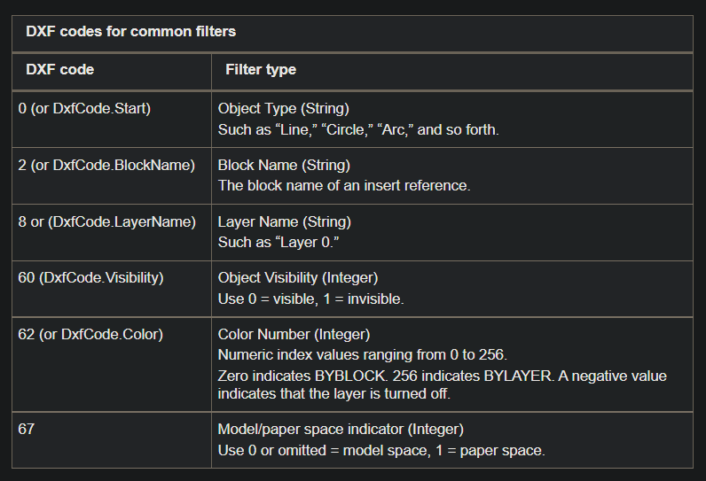

## Define Rules for Selection Filters
    - A selection filter list can be used to filter selected objects by properties or type.
    - Selection filters are composed of pairs of arguments in the form of TypedValues
        - First = type of filter (Object)
        - Second = value you are filtering on (Circle)

| "&" | Bitwise AND (integer groups only) |
| "&=" | Bitwise masked equals (integer groups only) |
